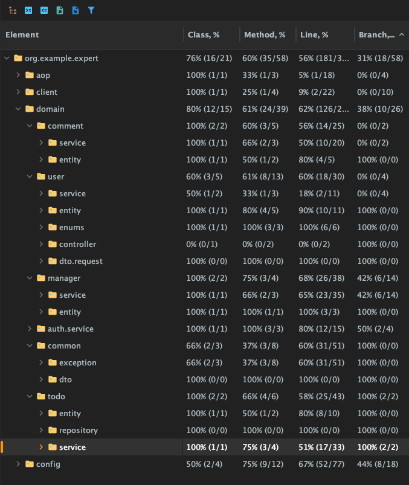

# SPRING ADVANCED
- 기존 코드를 리펙토릭하고 기록하기
- 테스트 작성해보고 커버리지 올리기
- 로그 기록하는 AOP 도입해보기
- @EntityGraph를 적용하여 N+1문제를 해결하기

## LV1 - Refactor
#### EarlyReturn 수정
- 예외 발생하는 코드를 signup() 메서드의 가장 첫번째로 이동하여 예외가 발생하면 하위 코드는 실행하지 않고 바로 예외가 던져지도록 수정

#### 불필요한 if-else 피하기
- if - else 문을 제거하고 각각의 예외 상황을 if문으로 분리
- 분리된 if문 예외의 순서를 조정하여 예외가 발생하기 전 불필요한 로직이 실행되지 않도록 조정

#### 불필요한 if-else 피하기
- userService의 changePassword()메서드 중 비밀번호 패턴 검증 코드 제거
- UserChangePasswordRequest에 @Pattern 도입
- UserController의 비밀번호 변경 api에 @Valid 적용
- GlobalExceptionHandler에서 BeanValidation 관련 예외가 발생했을 때 응답하는 핸들러 추가

## LV2 - N + 1 문제 해결 분석 및 EntityGraph 적용
#### 기존 N + 1 문제 해결 분석과 EntityGraph 적용
- 일정을 전체 조회하는 findAllByOrderByModifiedAtDesc() 메서드에 @EntityGraph 적용 
- 기존에는 JPQL의 fetch join을 활용하여 lazy 로딩되는 연관 객체를 한번에 불러와서 join하였으나 원래 fetch join과 Page 객체를 같이 사용하면 제대로 페이징이 되지 않거나 한번에 데이터를 다 불러와서 메모리에서 페이징을 하는 등의 비정상 동작이 발생할 수 있음
- @EntityGraph를 활용하여 fetch join을 사용하는 방법과 동일한 효과를 얻지만 Paging도 그대로 사용할 수 있음
- 그리고 SpringDate의 메서드 이름으로 만들어지는 쿼리가 EntityGraph를 적용하여 날려야할 쿼리랑 동일하기 때문에 @Query 애노테이션은 삭제해도 됨

## LV3 - 잘못된 테스트 코드 수정 및 테스트가 정상 동작하도록 로직을 수정
#### Test1-1 - matches_메서드가_정상적으로_동작한다() 테스트 메서드 수정
- matches()를 호출할 때 인자의 위치를 바꿔서 입력한 것을 수정

#### Test2-1 - manager_목록_조회_시_Todo가_없다면_NPE_에러를_던진다() 테스트 메서드 수정
- manager 목록 조회 시 Todo가 없을 때 테스트하는 코드의 메서드 명과 검증 코드의 발생할 예외 메시지를 수정하여 정상 테스트로 수정

#### Test2-2 - comment_등록_중_할일을_찾지_못해_에러가_발생한다() 테스트 메서드 수정
- comment 등록 중 할일을 찾이 못해 에러가 발생하는 테스트 코드 작성 시 ServerException이 아니라 InvalidRequestException이 발생하므로 코드를 수정

#### Test2-3 - todo의_user가_null인_경우_예외가_발생한다() 테스트 메서드가 성공하도록 기존 로직을 수정
- todo의 user가 null인 경우 예외가 발생하는 테스트가 정상적으로 동작하도록 ManagerService의 saveManager() 메서드에 todo.getUser의 null을 체크하는 코드를 추가

## LV4 - Admin 관련 API에 접근 로그 AOP 생성
- AdminApiLogAspect 추가 (AOP)
- AOP에서 reqeust, response를 사용할 수 있도록 Wrapper로 감싸서 캐싱하는 코드를 JwtFilter에 추가

## LV5 - 내가 정의한 문제와 해결 과정 - 버그픽스 및 리펙토링 회고 기록
- https://nagul2.tistory.com/494

## LV6 - 테스트 커버리지
